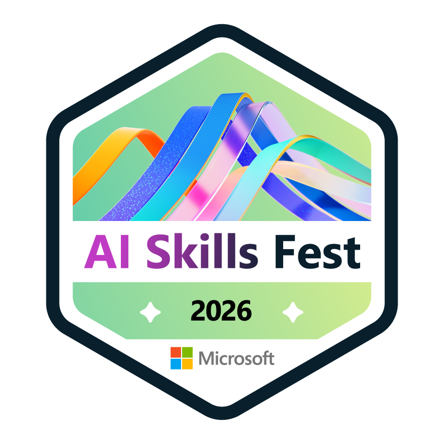

# 👋 Bonjour, je suis Youmnath MOUTAIROU

🎓 Étudiant ingénieur en **Intelligence Artificielle & Big Data** à **ESIGELEC**  
💼 À la recherche d'une **alternance de 36 mois** à partir de septembre 2026  
📍 Poitiers, France

---

## 🧑‍💻 À propos de moi

Étudiant ingénieur à ESIGELEC, spécialisé en **Intelligence Artificielle & Big Data**, je développe progressivement mes compétences en programmation, données et systèmes intelligents.

Je m'intéresse particulièrement à l'**Intelligence Artificielle**, aux données et à leurs applications dans les **systèmes industriels**.

---

## 🛠️ Compétences

- **Programmation :** C · Java *(en apprentissage)*
- **Structures de données :** listes chaînées · buffers circulaires · gestion dynamique de mémoire
- **Développement :** Git · GitHub · Code::Blocks · Eclipse
- **IA & Data :** Intelligence Artificielle · Big Data · données industrielles
- **Méthodes :** tests · validation · résolution de problèmes · travail en équipe

---
## 📜 Certifications & Badges

### 🏅 Microsoft — AI Skills Fest 2026

  

  <a href="https://www.credly.com/badges/8f15d318-fa78-4f20-92b0-7a8a5ee187e6/public_url">
    <strong>Voir le badge vérifié sur Credly →</strong>
  </a>

### 🤖 Intelligence Artificielle

- [**IA générative**](./certifications/IA_g_n_rative_Certificate.pdf) — 27 septembre 2026
- [**L'IA pour tous**](./certifications/L_IA_pour_tous_Certificate.pdf) — 11 juillet 2026

### 📊 Données

- [**Gestion des données avec Microsoft 365**](./certifications/Gestion_des_donn_es_avec_Micro_Certificate.pdf) — 26 août 2026
- [**Create a Budget with Google Sheets**](https://coursera.org/verify/MT6VS6IRIQ64) — 27 juillet 2026

### 💻 Outils numériques

- [**Designing and Formatting a Presentation in PowerPoint**](https://coursera.org/verify/WQMB7R7UWDZ7) — 27 juillet 2026
- [**Getting Started with Microsoft OneDrive**](https://coursera.org/verify/AZ4NPBHUVU5K) — 27 juillet 2026
- [**Compétences Internet pour une utilisation quotidienne**](./certifications/Comp_tences_Internet_pour_une__Certificate.pdf) — 26 août 2026

  
## 🚀 Projets

### 🚗 Black Box embarquée en C

Projet de groupe réalisé en **C** autour de la conception d'une boîte noire pour véhicule.

- Conception d'un **buffer circulaire dynamique**
- Utilisation de **listes chaînées**
- Gestion dynamique de la mémoire avec `malloc`, `calloc` et `free`
- Enregistrement des données
- Simulation de données liées au véhicule
- Tests et validation
- Utilisation de **Git / GitHub**

### 🤖 Simulateur robotique — Robot sauveteur en Java

Projet réalisé à l'**ESIGELEC** autour de la simulation d'un robot autonome dans un environnement virtuel.

- Développement en **Java**
- Simulation des déplacements et de la navigation d'un **robot sauveteur**
- Exploration et cartographie de l'environnement
- Recherche et détection de victimes
- Mémorisation des déplacements et des itinéraires
- Utilisation de tableaux 1D/2D et d'`ArrayList`
- Optimisation des itinéraires
- Tests et débogage avec Eclipse
- Travail en équipe

### 🏆 FIRST LEGO League — Robot autonome

Participation à la première édition nationale de la **FIRST LEGO League au Bénin**.

- Conception et programmation d'un robot autonome
- Utilisation de capteurs
- Adaptation du comportement du robot à son environnement
- Travail en équipe
- Présentation devant un jury
- 🏅 Médaille obtenue pour la conception et la programmation

---

## 🎓 Formation

### ESIGELEC — Cycle Ingénieur Généraliste

**Filière Intelligence Artificielle & Big Data**  
2026 — 2029 · Poitiers, France

### Cycle Préparatoire Père Aupiais — CPPA

**Classes Préparatoires Scientifiques MPSI**  
2024 — 2026 · Cotonou, Bénin

---

## 🌍 Langues

- 🇫🇷 **Français** — langue maternelle
- 🇬🇧 **Anglais** — B2
- 🇪🇸 **Espagnol** — A1

---

## 🎯 Objectif professionnel

Construire une expertise en **Intelligence Artificielle & Big Data** et contribuer à des projets associant **données, systèmes intelligents et applications industrielles**.

---

## 📫 Me contacter

- 💼 [LinkedIn — Youmnath MOUTAIROU](https://www.linkedin.com/in/youmnath-moutairou/)
- 🐙 [GitHub — Youmnath](https://github.com/Youmnath)

---

  ⭐ Merci de votre visite sur mon profil GitHub !

